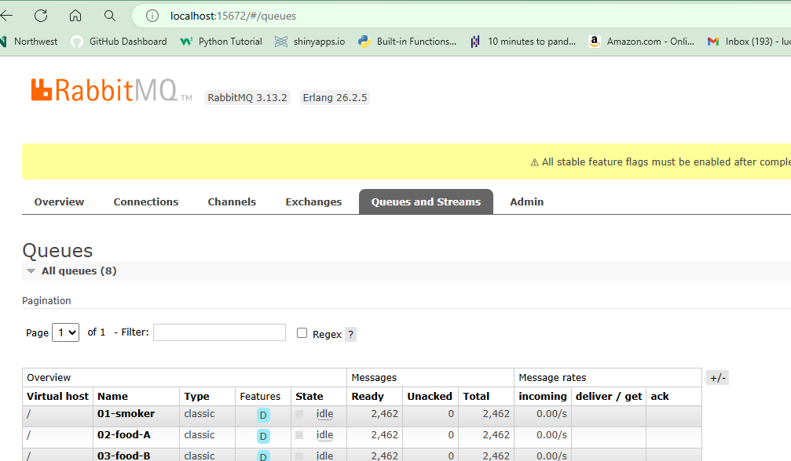

# Streaming Smart Smoker Temps: Module 5
## Student Author: Luci McDaniel
### GitHub Profile: https://github.com/LuciMcD
### Date: May 31, 2024

## Overview
This repo is designed to simulate reading temperatures of a smart smoker, and food inside the smoker and sending those temperatures to a consumer. The producer code (bbq_producer.py) is sending 3 separate columns of data to 3 coresponding queues using RabbitMQ as the queue holder. Then the consumers will pull that data from the queque.

## To Start
1. Fork this repo into your GitHub.
2. Clone your repo down to your machine. I use VS Code for this. 
3. Make sure pika, and all other imports are installed on your machine or in your virtual environment. 
    For Windows:
    python -m pip install pika

## Creating a virtual environment(Windows)
1. Open a new terminal
2. python -m venv .venv 
3. There may be a pop-up, asking if you would like to open a virtual environment. Select Yes.
4. Next activate the virtual environment (.venv):
        .venv\Scripts\Activate
5. Now you can install whichever modules into the .venv

## Screenshots
This is the logger showing the data sent by the bbq_producer.py

This is the data in the 3 different queues.

## The Consumers
I chose to use 3 separate consumers. The 01-smoker-consumer.py reads the temperature of the smoker and alerts when the temperature falls below 15 degrees F. Then 02-food-A-consumer and 03-food-B-consumer read their corresponding food temps and alerts when the food temp changes less than 1 degree. 

This the log showing the first smoker alert.

This is the log showing the first foodA alert.

This is the log showing the first foodB alert.
